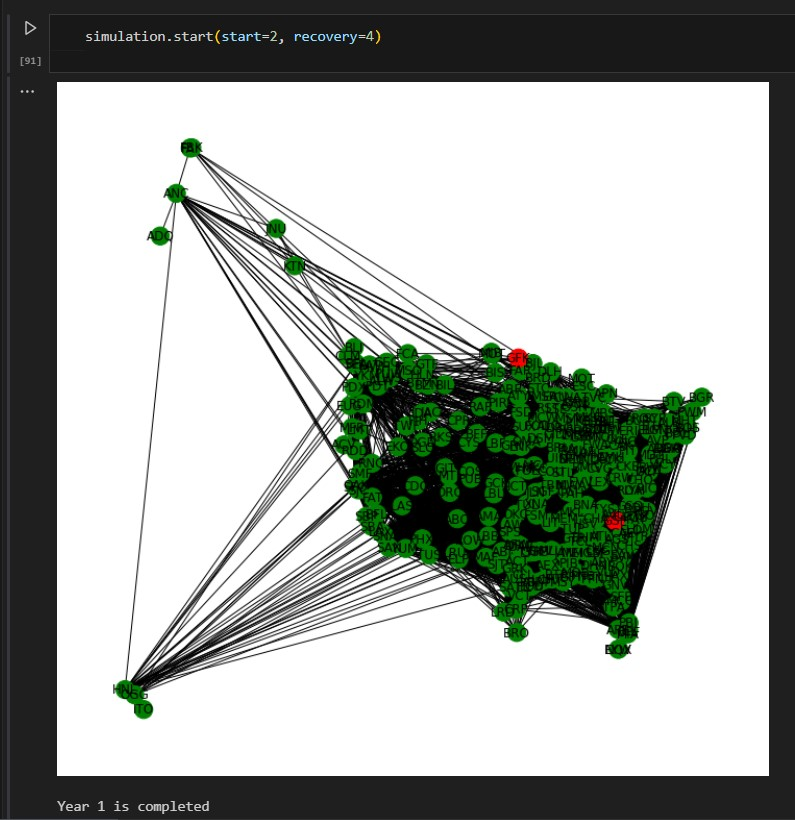
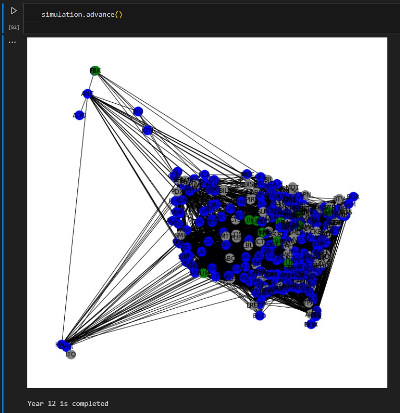
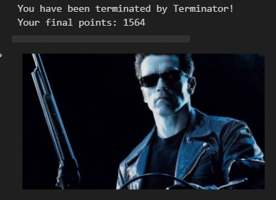

# Complex Network Analysis

Technologies & methodologies utilized for this project:

**1) Python** (pandas, numpy, matplotlib, networkx [a library for drawing graph networks])

**2) Object Oriented Programming** (created 1 simulation and 1 game with the network)  

---

**Overview:** This project utilizes the "USA Airport Dataset" from [Kaggle](https://www.kaggle.com/datasets/flashgordon/usa-airport-dataset) to conduct a comprehensive analysis of complex networks. The main objectives include:

1) Creating geospatial and network data visualizations.

2) Conducting various analyses, focusing on:

- Identifying the most central airports.
- Finding the shortest paths between airports.
- Clustering airports using different graph model techniques.

3) Creates 2 different object oriented dynamic models:

**i. Epidemic Simulation:** This simulation employs the dataset's 290 domestic airports in the USA. Users can customize (default values are available for all):
- The number of airports where the epidemic starts.
- Recovery time after which airports return to normal operations, becoming immune to the disease.
- The likelihood of an infected airport spreading the virus to connected airports.
- The likelihood of an airport facing a fatal outcome or shutting down due to dire conditions.
Screenshots from a run showing year 1 and year 12 are provided.

**ii. Bounty Hunter Game:** Embark on a heart-pounding escape in the USA as you flee from relentless bounty hunters and predators. You start with 10 pursuers, but the challenge may intensify as you can increase their numbers.

Strategically use domestic airports to stay one step ahead. At the beginning, you're randomly assigned to an airport, and you can fly to connected ones in each round. But beware, the hunters and predators follow your every move, making survival a thrilling test of wit.

The longer you evade capture, the higher your chances of winning. Collect points based on the airport's degree (number of connections) but remember, crowded airports offer more points and danger. Choose wisely and escape the hunters' clutches!

